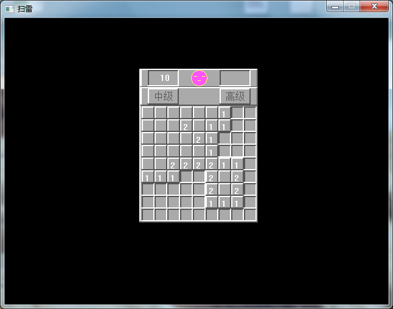
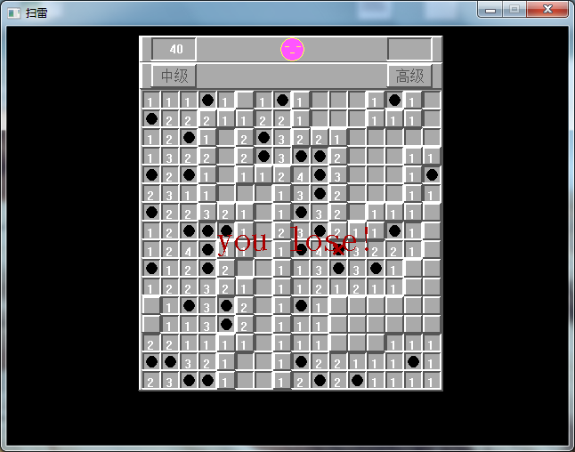
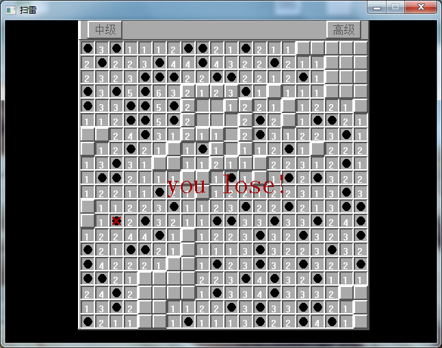

# The minesweeper game
### This program is implemented using pure C++ language and EasyX library functions.
### The Easy X website:(http://www.easyx.cn/)
### Although this file is a CPP , but the code is complete C language.Because the EasyX library supports CPP format.
***
###There are three levels of the game：

- primary  
- intermediate
- advanced

#### Primary

#### Intermediate

#### Advanced

